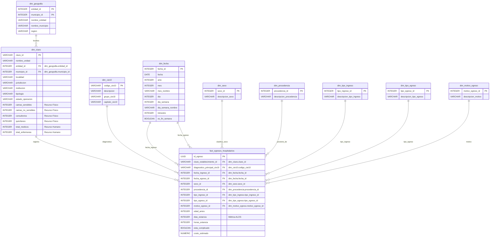

# SaludMX Analytics Pipeline 📊🏥

## 🌟 Ecosistema End-to-End de Datos Clínicos (Secretaría de Salud de México)

Un ecosistema avanzado de ingeniería de datos, modelado analítico y ciencia de datos diseñado para analizar la **carga hospitalaria**, estimar el **tiempo promedio de estancia (ALOS)** y correlacionar la **disponibilidad de recursos físicos, materiales y humanos** con la eficiencia operativa en los establecimientos de salud de México.

---

## 🏗️ 1. Arquitectura de Datos E2E

El pipeline está diseñado bajo los principios de **DataOps** y **Modern Data Stack**, utilizando Dagster para la orquestación, Docker para el aislamiento, PostgreSQL como Data Warehouse dimensional, y Power BI junto con Scikit-learn para la analítica avanzada.

```mermaid
graph TD
    %% Fuentes de Datos
    subgraph Fuentes de Datos (DGIS / SSA)
        Raw_SAEH[SAEH CSV <br> Microdatos de Egresos]
        Raw_CLUES[CLUES CSV/XLS <br> Catálogo Maestro]
        Raw_Rec_Fis[Recursos Físicos CSV <br> Camas, Quirofanos...]
        Raw_Rec_Hum[Recursos Humanos CSV <br> Médicos, Enfermeras...]
    end

    %% Capa de Orquestación y ETL
    subgraph Orquestación con Dagster (Capa de Cómputo)
        Asset_Ingest[Asset: Ingesta RAW] --> Asset_Clean[Asset: Limpieza & Normalización]
        Asset_Clean --> Asset_Transform[Asset: Transformación Dimensional]
    end

    %% Base de Datos
    subgraph PostgreSQL Data Warehouse (Docker)
        Staging_Tables[(Tablas de Staging <br> s_saeh, s_clues, s_recursos)]
        Star_Schema[("Modelo Dimensional (Star Schema)" <br> fact_egresos_hospitalarios <br> dim_clues, dim_cie10, dim_fecha...)]
        Staging_Tables -->|ETL de Inserción| Star_Schema
    end

    %% Consumo y Modelado
    subgraph Capa de Consumo (Analítica & Ciencia de Datos)
        PBI_Dashboard[Power BI Desktop <br> Métricas de ALOS & Suministros]
        DS_Model[Modelo de Machine Learning <br> Estimación de Estancia (Regresión)]
    end

    %% Conexiones entre componentes
    Raw_SAEH -->|Lectura con Encodings| Asset_Ingest
    Raw_CLUES -->|Lectura con Encodings| Asset_Ingest
    Raw_Rec_Fis -->|Lectura con Encodings| Asset_Ingest
    Raw_Rec_Hum -->|Lectura con Encodings| Asset_Ingest

    Asset_Transform -->|Carga de Staging| Staging_Tables
    Star_Schema -->|DirectQuery / Import| PBI_Dashboard
    Star_Schema -->|Dataset de Entrenamiento| DS_Model
```

---

## 🗄️ 2. Diseño del Modelo Dimensional (Star Schema)

Para garantizar la máxima velocidad de consulta en Power BI y simplificar la extracción de características para el modelo de Machine Learning, implementamos un **Esquema de Estrella** robusto en PostgreSQL.



---

## 🛠️ 3. Retos de Ingesta y Limpieza de Datos (DGIS SSA)

Los microdatos de la Secretaría de Salud de México presentan desafíos técnicos sistemáticos. El pipeline de Dagster resolverá de manera canónica los siguientes puntos:

### 🧩 Encodings Latinoamericanos
*   **Problema:** Los archivos de egresos y catálogos de la SSA suelen exportarse con codificaciones heredadas como `ISO-8859-1`, `latin-1` o `cp1252`. Forzar la lectura en `utf-8` provoca un fallo de detención de ejecución o caracteres rotos (e.g., `México` por `México`).
*   **Solución:** Detección dinámica y especificación explícita del encoding en Pandas:
    ```python
    df = pd.read_csv("archivo.csv", encoding="latin-1", low_memory=False)
    ```
*   **Normalización:** Todas las columnas de texto se limpian de acentos, caracteres especiales y se convierten a mayúsculas para unificar uniones en SQL:
    ```python
    df['municipio'] = df['municipio'].str.normalize('NFKD').str.encode('ascii', errors='ignore').str.decode('utf-8').str.upper()
    ```

### 📅 Inconsistencia de Fechas
*   **Problema:** Campos como fecha de ingreso o egreso varían de formato año con año (e.g., `DD/MM/YYYY`, `YYYY-MM-DD`, enteros como `20231225`, o nulos codificados como `"  /  /    "`).
*   **Solución:** Lógica de análisis multi-formato coercitivo:
    ```python
    def clean_ssa_dates(series):
        # Reemplazar nulos textuales por NaN reales
        series = series.astype(str).replace(r'^\s*/\s*/\s*$', np.nan, regex=True)
        # Intentar parser automático coercitivo
        return pd.to_datetime(series, errors='coerce', format='mixed')
    ```

### 🔢 Preservación de Ceros a la Izquierda (Padding)
*   **Problema:** Los códigos de entidades federativas (01 a 32) y de municipios (e.g. 001, 015) son cargados por Pandas por defecto como flotantes o enteros, eliminando los ceros (e.g., `9` en lugar de `09` para la CDMX). Esto destruye las uniones espaciales y con catálogos.
*   **Solución:** Configuración estricta de tipos de datos en la lectura y padding artificial en el cleaning:
    ```python
    dtype_dict = {'entidad_id': str, 'municipio_id': str, 'clues_id': str}
    df = pd.read_csv("archivo.csv", dtype=dtype_dict)
    # En caso de necesitar padding:
    df['entidad_id'] = df['entidad_id'].str.strip().str.zfill(2)
    df['municipio_id'] = df['municipio_id'].str.strip().str.zfill(3)
    ```

---

## 🐳 4. Guía de Levantamiento de Entorno Docker

El entorno está completamente contenedorizado para garantizar portabilidad. Incluye una base de datos PostgreSQL 15, un servidor PgAdmin 4 para exploración rápida, y la interfaz web de Dagster daemon.

### Requisitos Previos
*   Docker Desktop instalado.
*   Al menos 4GB de RAM asignados al motor de Docker.

### Estructura de Contenedores (`docker-compose.yml`)

El archivo `docker-compose.yml` (que se creará en el repositorio) define tres servicios clave:

1.  **`postgres`**: Instancia de base de datos Postgres 15 con persistencia de volumen para el Data Warehouse.
2.  **`pgadmin`**: Interfaz de administración web para Postgres.
3.  **`dagster`**: Contenedor para orquestación que expone la interfaz Dagster Webserver en el puerto `3000`.

### Comandos de Levantamiento

```bash
# 1. Clonar el repositorio y moverse a la carpeta
cd clinical_data_project

# 2. Construir e iniciar los servicios en segundo plano
docker compose up -d --build

# 3. Validar que todos los contenedores estén corriendo
docker compose ps
```

*   **Dagster Webserver:** Acceda a [http://localhost:3000](http://localhost:3000) para ver y lanzar los assets.
*   **PgAdmin 4:** Acceda a [http://localhost:5050](http://localhost:5050) (Credenciales: `admin@saludmx.org` / `adminpass`).
*   **PostgreSQL:** Host: `localhost`, Puerto: `5432`, DB: `saludmx_dw`, User: `postgres_user`, Pass: `postgres_pass`.

---

## 📈 5. Plan de Hitos (Project Milestones Roadmap)

Para mayor visibilidad, las tareas se estructuran en 4 hitos secuenciales descritos en detalle en [project_backlog.json](file:///c:/VSCode/clinical_data_project/project_backlog.json):

```
🏁 MILESTONE 1: Ingesta y Aislamiento Docker (Estatus: Pendiente)
├── Configuración de Docker Compose (Postgres + Dagster)
└── Extracción robusta de archivos crudos de SSA (SAEH, CLUES) respetando encodings.

🏁 MILESTONE 2: Limpieza y Normalización Canónica (Estatus: Pendiente)
├── Normalización de Encodings e imputación de nulos estructurados.
└── Corrección de fechas multi-formato y empaquetado de códigos geográficos (zfill).

🏁 MILESTONE 3: Modelado Dimensional y Carga (Estatus: Pendiente)
├── Ejecución del script schema.sql para generar el Star Schema.
└── Pipeline Dagster para la transformación y carga final a tablas dimensionales (Staging -> Core).

🏁 MILESTONE 4: Analítica y Modelado Predictivo (Estatus: Pendiente)
├── Conexión de Power BI Desktop y creación del modelo de datos de estancia (ALOS).
└── Entrenamiento y serialización del modelo Scikit-learn para predecir estancia por CIE-10/Demografía.
```

---

> [!NOTE]
> Este repositorio se encuentra bajo desarrollo activo. El archivo [schema.sql](file:///c:/VSCode/clinical_data_project/schema.sql) contiene las definiciones DDL necesarias para iniciar la base de datos, mientras que la estructura lógica de los assets orquestados se encuentra en [dagster_assets.py](file:///c:/VSCode/clinical_data_project/dagster_assets.py).
